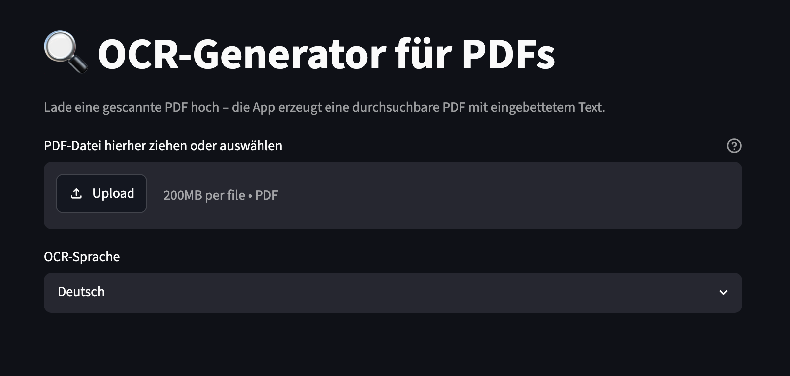

# OCR-Generator

Lokale Streamlit-App: gescannte PDFs hochladen → durchsuchbare PDFs herunterladen.
Unterstützt Batch-Upload (mehrere Dateien gleichzeitig).



---

## Voraussetzung

[Docker Desktop](https://www.docker.com/products/docker-desktop) installieren – das war's.
Kein Python-Setup, kein Homebrew, kein Tesseract manuell.

---

## Starten

```bash
# Einmalig (Build dauert ~2 Minuten):
docker compose up --build

# Danach immer nur:
docker compose up
```

Browser öffnen: **http://localhost:8501**

---

## Benutzung

1. Eine oder mehrere PDFs per Drag & Drop ins Upload-Feld ziehen
2. OCR-Sprache wählen (Deutsch / Englisch / beides)
3. „OCR starten" klicken
4. Jede Datei bekommt einen eigenen Download-Button

**Hinweis:** Seiten mit bereits vorhandenem, markierbarem Text werden automatisch übersprungen.

---

## Ohne Docker (nativ, macOS)

<details>
<summary>Anleitung aufklappen</summary>

```bash
# Systemabhängigkeiten
brew install tesseract tesseract-lang ghostscript unpaper pngquant

# Python-Umgebung
python -m venv .venv
source .venv/bin/activate
pip install -r requirements.txt

# App starten
streamlit run app.py
```

</details>
